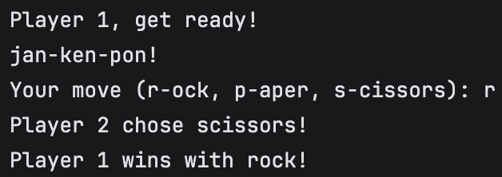

# Janken (Rock-Paper-Scissors)

Janken is a classic Japanese version of the Rock-Paper-Scissors game. Implemented in Ruby. This program allows one player to compete against a bot in interactive way. Player 2 (bot) randomly selects its moves.

## License

This project is licensed under the MIT License. See the LICENSE file for more details.

## Contact

For questions or suggestions, feel free to reach out via email or open an issue in the repository.

Enjoy playing Janken! 😊